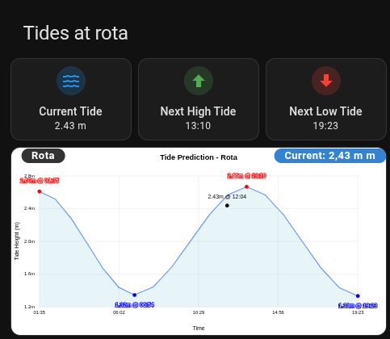

# Preferred Panel Configuration

Our recommended modern and functional panel configuration using Mushroom template cards with a professional layout.

## Features

- Horizontal layout with three template cards for key information
- Rounded picture elements with tide chart overlay
- Current tide height display with unit suffix
- Time-formatted next tide predictions
- Color-coded icons (blue for current, green for high, red for low)
- Responsive design with proper spacing
- Professional styling with rounded corners

## Screenshot



## Code

```yaml
type: vertical-stack
title: Tides at STATION_NAME
cards:
  - type: horizontal-stack
    cards:
      - type: custom:mushroom-template-card
        primary: Current Tide
        secondary: "{{ states('sensor.STATION_NAME_current_tide_height') }} m"
        icon: mdi:waves
        icon_color: blue
        layout: vertical
        fill_container: true
        tap_action:
          action: more-info
          entity: sensor.STATION_NAME_current_tide_height
      - type: custom:mushroom-template-card
        primary: Next High Tide
        secondary: >-
          {{ states('sensor.STATION_NAME_next_high_tide_time') | as_timestamp |
          timestamp_custom('%H:%M') }}
        icon: mdi:arrow-up-bold
        icon_color: green
        layout: vertical
        fill_container: true
        tap_action:
          action: more-info
          entity: sensor.STATION_NAME_next_high_tide_time
      - type: custom:mushroom-template-card
        primary: Next Low Tide
        secondary: >-
          {{ states('sensor.STATION_NAME_next_low_tide_time') | as_timestamp |
          timestamp_custom('%H:%M') }}
        icon: mdi:arrow-down-bold
        icon_color: red
        layout: vertical
        fill_container: true
        tap_action:
          action: more-info
          entity: sensor.STATION_NAME_next_low_tide_time
  - type: picture-elements
    camera_image: camera.STATION_NAME_tide_plot
    style: |
      ha-card {
        border-radius: 16px;
        overflow: hidden;
        margin-top: 16px;
      }
    elements:
      - entity: sensor.STATION_NAME_tide_station_info
        style:
          background-color: rgba(0, 0, 0, 0.8)
          color: white
          font-size: 13px
          line-height: 0px
          padding: 1px 5px
          border-radius: 10px
          pointer-events: none
          font-weight: bold
          left: 40px
          top: 10px
        type: state-label
      - entity: sensor.STATION_NAME_current_tide_height
        style:
          background-color: rgba(0, 100, 200, 0.8)
          color: white
          font-size: 13px
          line-height: 0px
          padding: 1px 5px
          border-radius: 10px
          pointer-events: none
          font-weight: bold
          right: "-70px"
          top: 10px
        prefix: "Current: "
        suffix: " m"
        type: state-label
```

## Usage Instructions

1. **Install Mushroom Cards**: Required for template cards
2. Replace `STATION_NAME` with your actual station name
3. Copy the YAML code above
4. Add it to your Home Assistant dashboard
5. Adjust the `title` to match your station name

## Customization Tips

- **Colors**: Change `icon_color` values (blue, green, red, orange, etc.)
- **Layout**: Modify `layout` to "horizontal" for side-by-side icon and text
- **Time Format**: Adjust `timestamp_custom('%H:%M')` for different time formats
- **Spacing**: Modify `margin-top` in the style section
- **Borders**: Change `border-radius` for different corner rounding

## Requirements

- **Mushroom Cards** custom component installed via HACS
- Modern Tides integration installed and configured
- Tide station with working camera entity

## Difficulty Level

⭐⭐⭐ **Advanced** - Combines custom components with CSS styling

## Why This is Our Preferred Configuration

- **Visual hierarchy**: Clear information organization
- **Modern design**: Clean, professional appearance
- **Functionality**: All key information accessible
- **Responsive**: Works well on mobile and desktop
- **Interactive**: Tap actions for detailed information
