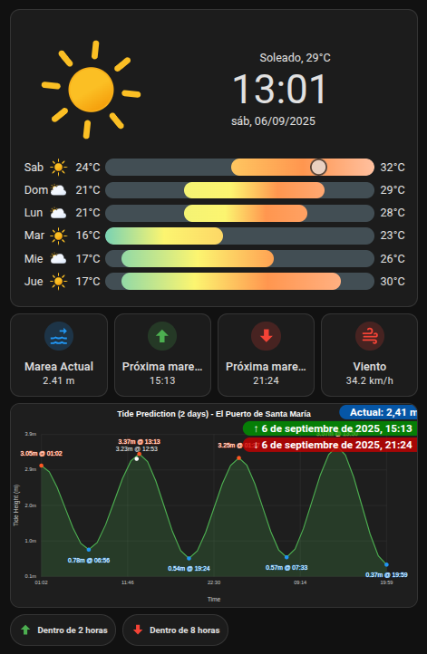

# Comprehensive Weather & Tides Dashboard

A complete weather and tide monitoring dashboard combining tide charts with weather forecasts, current conditions, and detailed overlays for comprehensive coastal information.

## Features

- **Weather integration**: Clock-weather card with 7-day forecast
- **Tide visualization**: Picture elements with multiple data overlays
- **Interactive elements**: Mushroom cards for quick tide information
- **Real-time data**: Current tide height, next high/low tides, and wind conditions
- **Chips navigation**: Quick access to tide times
- **Color-coded indicators**: Visual status for wind conditions and tide direction

## Screenshot



## Code

```yaml
type: vertical-stack
cards:
  - type: custom:clock-weather-card
    entity: weather.forecast_STATION_NAME
    title: STATION_NAME
    sun_entity: sun.sun
    temperature_sensor: sensor.STATION_NAME_temperature
    weather_icon_type: fill
    animated_icon: true
    forecast_rows: 7
    locale: en-US
    time_pattern: HH:mm
    time_format: 24
    date_pattern: ccc, d.MM.yy
    hide_today_section: false
    hide_forecast_section: false
    show_humidity: false
    hide_clock: false
    hide_date: false
    hourly_forecast: false
    use_browser_time: false
    time_zone: null
    show_decimal: false
  - type: picture-elements
    camera_image: camera.STATION_NAME_tide_plot
    elements:
      - entity: sensor.STATION_NAME_tide_station_info
        style:
          background-color: rgba(0, 0, 0, 0.8)
          color: white
          font-size: 13px
          line-height: 0px
          padding: 1px 5px
          border-radius: 10px
          pointer-events: none
          font-weight: bold
          left: 30px
          top: 10px
        type: state-label
      - entity: sensor.STATION_NAME_current_tide_height
        style:
          background-color: rgba(0, 100, 200, 0.8)
          color: white
          font-size: 13px
          line-height: 0px
          padding: 1px 5px
          border-radius: 10px
          pointer-events: none
          font-weight: bold
          right: "-60px"
          top: 10px
        prefix: "Now: "
        suffix: " m"
        type: state-label
      - entity: sensor.STATION_NAME_next_high_tide_time
        style:
          background-color: rgba(0, 150, 0, 0.8)
          color: white
          font-size: 13px
          line-height: 0px
          padding: 1px 5px
          border-radius: 10px
          pointer-events: none
          font-weight: bold
          right: "-77px"
          top: 30px
        prefix: "↑ "
        type: state-label
      - entity: sensor.STATION_NAME_next_low_tide_time
        style:
          background-color: rgba(200, 0, 0, 0.8)
          color: white
          font-size: 13px
          line-height: 0px
          padding: 1px 5px
          border-radius: 10px
          pointer-events: none
          font-weight: bold
          right: "-77px"
          top: 50px
        prefix: "↓ "
        type: state-label
  - type: horizontal-stack
    cards:
      - type: custom:mushroom-template-card
        primary: Current
        secondary: "{{ states('sensor.STATION_NAME_current_tide_height') }} m"
        icon: >-
               
            mdi:waves-arrow-right
          
            mdi:waves-arrow-left
          
        icon_color: >-
               
            blue
          
            green
          
        layout: vertical
        fill_container: true
        tap_action:
          action: more-info
          entity: sensor.STATION_NAME_current_tide_height
      - type: custom:mushroom-template-card
        primary: High Tide
        secondary: >-
          {{ states('sensor.STATION_NAME_next_high_tide_time') | as_timestamp |
          timestamp_custom('%H:%M') }}
        icon: mdi:waves-arrow-right
        icon_color: blue
        layout: vertical
        fill_container: true
        tap_action:
          action: more-info
          entity: sensor.STATION_NAME_next_high_tide_time
      - type: custom:mushroom-template-card
        primary: Low Tide
        secondary: >-
          {{ states('sensor.STATION_NAME_next_low_tide_time') | as_timestamp |
          timestamp_custom('%H:%M') }}
        icon: mdi:waves-arrow-left
        icon_color: green
        layout: vertical
        fill_container: true
        tap_action:
          action: more-info
          entity: sensor.STATION_NAME_next_low_tide_time
      - type: custom:mushroom-template-card
        primary: Wind
        secondary: >-
          {{ state_attr('weather.forecast_STATION_NAME', 'wind_speed') }} {{
          state_attr('weather.forecast_STATION_NAME', 'wind_speed_unit') }}
        icon: mdi:weather-windy
        icon_color: >-
           
            green
          
            yellow
          
            red
          
        layout: vertical
        fill_container: true
        tap_action:
          action: more-info
          entity: sensor.STATION_NAME_wind
  - type: custom:mushroom-chips-card
    chips:
      - type: entity
        entity: sensor.STATION_NAME_next_high_tide_time
        icon: mdi:arrow-up-bold
        icon_color: green
        content_info: state
        tap_action:
          action: more-info
      - type: entity
        entity: sensor.STATION_NAME_next_low_tide_time
        icon: mdi:arrow-down-bold
        icon_color: red
        content_info: state
        tap_action:
          action: more-info
```

## Usage Instructions

1. **Configure a tide station** in the Modern Tides integration
2. **Install required custom components**:
   - [Clock Weather Card](https://github.com/pkissling/clock-weather-card)
   - [Mushroom Cards](https://github.com/piitaya/lovelace-mushroom)
3. Replace `STATION_NAME` with your actual configured station name
4. Configure weather entity for your location (`weather.forecast_STATION_NAME`)
5. Set up temperature sensor if available (`sensor.STATION_NAME_temperature`)
6. Copy the YAML code above and add it to your Home Assistant dashboard

## Requirements

- Modern Tides integration installed and configured
- **Clock Weather Card** custom component
- **Mushroom Cards** custom component
- Weather integration for your location
- Temperature sensor (optional)
- Wind sensor (optional)

## Entity Mapping

Make sure you have these entities configured:

### Modern Tides Entities
- `camera.STATION_NAME_tide_plot` - Tide chart camera
- `sensor.STATION_NAME_tide_station_info` - Station information
- `sensor.STATION_NAME_current_tide_height` - Current tide level
- `sensor.STATION_NAME_next_high_tide_time` - Next high tide time
- `sensor.STATION_NAME_next_low_tide_time` - Next low tide time

### Weather Entities (configure separately)
- `weather.forecast_STATION_NAME` - Weather forecast
- `sensor.STATION_NAME_temperature` - Temperature sensor
- `sensor.STATION_NAME_wind` - Wind sensor

## Customization Options

### Dark Mode Support

For dark-themed dashboards, use the dark mode camera:

```yaml
camera_image: camera.STATION_NAME_tide_plot_dark
```

### Weather Locale

Change the locale for weather display:

```yaml
locale: es-ES  # Spanish
locale: fr-FR  # French
locale: de-DE  # German
```

### Color Customization

Modify overlay colors:

```yaml
# Station info overlay
background-color: rgba(0, 0, 0, 0.8)  # Black background
background-color: rgba(0, 100, 200, 0.8)  # Blue for current height
background-color: rgba(0, 150, 0, 0.8)    # Green for high tide
background-color: rgba(200, 0, 0, 0.8)    # Red for low tide
```

## Difficulty Level

⭐⭐⭐ **Advanced** - Requires multiple custom components and weather integration

## Best Use Cases

- **Marine weather stations**: Complete coastal monitoring
- **Sailing/boating**: Weather and tide planning
- **Fishing operations**: Optimal timing conditions
- **Coastal research**: Comprehensive data display
- **Beach management**: Safety and planning information
- **Harbor operations**: Complete maritime conditions

## Performance Notes

- Weather card updates every 30 minutes
- Tide data updates every 15 minutes  
- Mushroom cards are lightweight and responsive
- Consider grouping weather entities in a separate integration
- Multiple overlays may impact rendering on slower devices

## Troubleshooting

### Common Issues

1. **Clock Weather Card not showing**: Install the custom component via HACS
2. **Mushroom cards missing**: Install Mushroom via HACS
3. **Weather entity not found**: Configure weather integration for your location
4. **Temperature/wind sensors unavailable**: These are optional, remove if not available

### Alternative Weather Entities

If `weather.forecast_STATION_NAME` doesn't exist, use:

- `weather.home` - Default Home Assistant weather
- `weather.openweathermap` - OpenWeatherMap integration
- `weather.met` - Met.no integration
