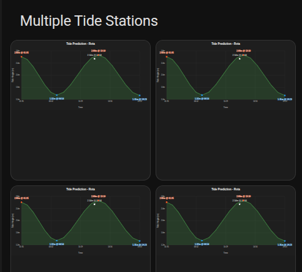

# Multiple Stations Dashboard

A grid layout showcasing tide information from multiple tide stations simultaneously for comprehensive coastal monitoring.

## Features

- **Grid layout**: Clean 2-column display for multiple stations
- **Station comparison**: View multiple ports at once
- **Full-width labels**: Station information overlay across the bottom
- **Scalable design**: Easy to add more stations
- **Regional monitoring**: Perfect for coastal areas or marine operations

## Screenshot



## Code

```yaml
type: grid
title: Multiple Tide Stations
columns: 2
cards:
  - type: picture-elements
    camera_image: camera.STATION_NAME_1_tide_plot
    elements:
      - entity: sensor.STATION_NAME_1_tide_station_info
        style:
          display: none
        type: state-label
  - type: picture-elements
    camera_image: camera.STATION_NAME_2_tide_plot
    elements:
      - entity: sensor.STATION_NAME_2_tide_station_info
        style:
          display: none
        type: state-label
  - type: picture-elements
    camera_image: camera.STATION_NAME_3_tide_plot
    elements:
      - entity: sensor.STATION_NAME_3_tide_station_info
        style:
          display: none
        type: state-label
  - type: picture-elements
    camera_image: camera.STATION_NAME_4_tide_plot
    elements:
      - entity: sensor.STATION_NAME_4_tide_station_info
        style:
          display: none
        type: state-label
```

## Usage Instructions

1. **Configure multiple stations** in the Modern Tides integration
2. Replace the station placeholders (`STATION_NAME_1`, `STATION_NAME_2`, etc.) with your actual configured stations
3. Copy the YAML code above
4. Add it to your Home Assistant dashboard
5. Adjust the `columns` value for different layouts (1, 2, 3, 4, etc.)

## Example Station Names

Common stations you can configure (replace the placeholders with these or your preferred stations):

- **cadiz** - Cádiz
- **barcelona** - Barcelona  
- **valencia** - Valencia
- **malaga** - Málaga
- **santander** - Santander
- **coruna** - A Coruña
- **bilbao** - Bilbao
- **palma** - Palma de Mallorca
- **cartagena** - Cartagena
- **gijon** - Gijón

## Customization Options

### Layout Variations

```yaml
# Single column (mobile-friendly)
columns: 1

# Three columns (wide screens)
columns: 3

# Four columns (ultra-wide displays)
columns: 4
```

### Adding More Stations

Simply add more cards to the `cards:` array:

```yaml
  - type: picture-elements
    camera_image: camera.STATION_NAME_tide_plot
    elements:
      - entity: sensor.STATION_NAME_tide_station_info
        style:
          display: none
        type: state-label
```

### Dark Mode Support

For dark-themed dashboards, use the dark mode camera entities:

```yaml
camera_image: camera.STATION_NAME_tide_plot_dark
```

## Requirements

- Modern Tides integration installed and configured
- **Multiple tide stations configured** (at least 2, ideally 4+)
- Sufficient screen space for grid layout

## Difficulty Level

⭐⭐ **Intermediate** - Requires multiple station configuration

## Best Use Cases

- **Marine operations**: Monitoring multiple ports
- **Coastal management**: Regional tide overview
- **Sailing/boating**: Trip planning across regions
- **Research**: Comparative tide analysis
- **Emergency services**: Coastal monitoring stations
- **Weather stations**: Maritime data displays

## Performance Notes

- Each station generates its own tide plot
- More stations = more API calls and processing
- Recommended maximum: 6-8 stations per dashboard
- Consider separate dashboards for different regions
