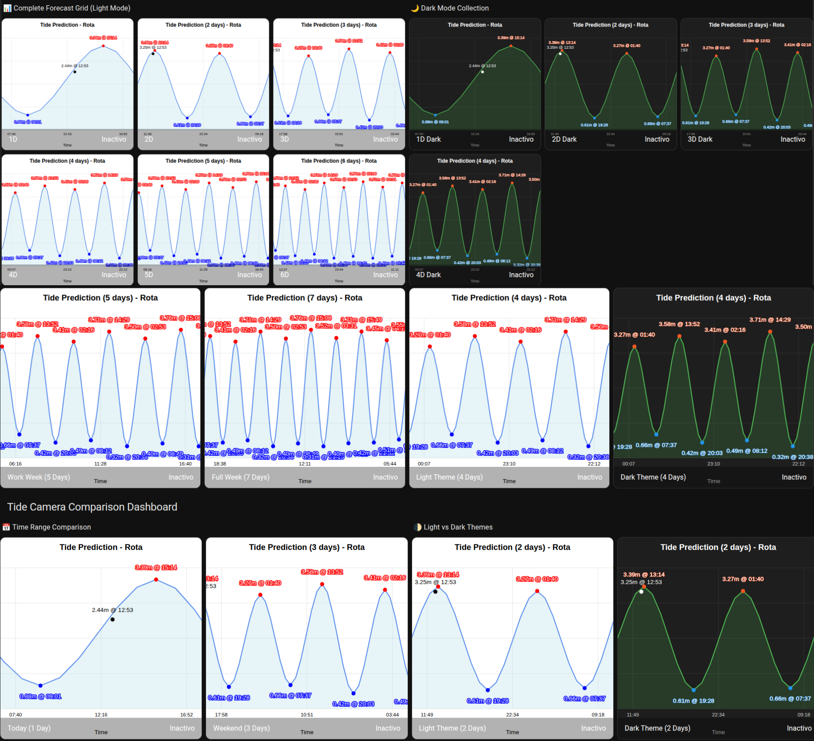

# Multi-Day Tide Plot Camera Entities

A comprehensive guide to using the automatic multi-day camera entities for tide predictions from single-day views to full week forecasts.

## Features

- **Flexible time ranges**: 1 day to 7 days of tide predictions
- **14 camera entities per station**: Light and dark modes for each time range
- **Easy integration**: Just use camera entities like any other HA entity
- **Automatic updates**: All plots refresh automatically
- **No configuration needed**: All cameras created automatically

## Screenshot



## Available Camera Entities

### Light Mode Cameras
- `camera.STATION_NAME_tide_plot` - 1 day (default)
- `camera.STATION_NAME_tide_plot_2d` - 2 days
- `camera.STATION_NAME_tide_plot_3d` - 3 days
- `camera.STATION_NAME_tide_plot_4d` - 4 days
- `camera.STATION_NAME_tide_plot_5d` - 5 days
- `camera.STATION_NAME_tide_plot_6d` - 6 days
- `camera.STATION_NAME_tide_plot_7d` - 7 days

### Dark Mode Cameras
- `camera.STATION_NAME_tide_plot_dark` - 1 day
- `camera.STATION_NAME_tide_plot_2d_dark` - 2 days
- `camera.STATION_NAME_tide_plot_3d_dark` - 3 days
- `camera.STATION_NAME_tide_plot_4d_dark` - 4 days
- `camera.STATION_NAME_tide_plot_5d_dark` - 5 days
- `camera.STATION_NAME_tide_plot_6d_dark` - 6 days
- `camera.STATION_NAME_tide_plot_7d_dark` - 7 days

## Basic Dashboard Example

```yaml
type: grid
title: Multi-Day Tide Forecasts - STATION_NAME
columns: 2
cards:
  # Single Day vs Week Comparison
  - type: vertical-stack
    cards:
      - type: heading
        heading: Daily Forecast
        heading_style: title
      - entity: camera.STATION_NAME_tide_plot
        
  - type: vertical-stack
    cards:
      - type: heading
        heading: Weekly Forecast
        heading_style: title
      - entity: camera.STATION_NAME_tide_plot_7d

  # 2-Day and 3-Day Views
  - type: vertical-stack
    cards:
      - type: heading
        heading: 2-Day Forecast
        heading_style: subtitle
      - entity: camera.STATION_NAME_tide_plot_2d
        
  - type: vertical-stack
    cards:
      - type: heading
        heading: 3-Day Forecast
        heading_style: subtitle
      - entity: camera.STATION_NAME_tide_plot_3d

  # 4-Day and 5-Day Views
  - type: vertical-stack
    cards:
      - type: heading
        heading: 4-Day Forecast
        heading_style: subtitle
      - entity: camera.STATION_NAME_tide_plot_4d
        
  - type: vertical-stack
    cards:
      - type: heading
        heading: 5-Day Forecast
        heading_style: subtitle
      - entity: camera.STATION_NAME_tide_plot_5d

  # Dark Mode Examples
  - type: vertical-stack
    cards:
      - type: heading
        heading: 6-Day Forecast (Dark)
        heading_style: subtitle
      - entity: camera.STATION_NAME_tide_plot_6d_dark
        
  - type: vertical-stack
    cards:
      - type: heading
        heading: Current vs Weekly (Dark)
        heading_style: subtitle
      - entity: camera.STATION_NAME_tide_plot_dark
      - entity: camera.STATION_NAME_tide_plot_7d_dark
```

## Usage Instructions

1. **Configure a tide station** in the Modern Tides integration
2. Replace `STATION_NAME` with your actual station name (e.g., `cadiz`, `barcelona`)
3. Copy the YAML code above
4. Add it to your Home Assistant dashboard
5. All 14 camera entities are automatically created - just choose which ones to use

## Camera Entity Examples

### Single Camera Focus
```yaml
# Focus on just one time range
- entity: camera.STATION_NAME_tide_plot_3d
  name: 3-Day Tide Forecast
```

### Picture Elements Integration
```yaml
# Use in picture elements for overlays
type: picture-elements
camera_image: camera.STATION_NAME_tide_plot_7d
elements:
  - type: state-label
    entity: sensor.STATION_NAME_current_tide_height
    style:
      top: 10%
      left: 10%
```

### Entities Card Integration
```yaml
# Mix with sensor data
type: entities
entities:
  - sensor.STATION_NAME_current_tide_height
  - sensor.STATION_NAME_next_high_tide_time
  - camera.STATION_NAME_tide_plot_3d
```

### Grid Layout Customization
```yaml
# Change columns for horizontal layout
columns: 4  # Shows 4 cameras per row
```

### Dark Theme Integration
```yaml
# Perfect for dark-themed dashboards
- entity: camera.STATION_NAME_tide_plot_7d_dark
  name: Weekly Forecast (Dark)
```

### Custom Headings
```yaml
# Customize section titles
- type: heading
  heading: "Weekend Tides"
  heading_style: title
```

### Dark Theme Integration
```yaml
# Perfect for dark-themed dashboards
image: /local/moderntides_STATION_NAME_plot_7d_dark.svg
```

## Perfect Use Cases

### Marine Activities
- **Sailing**: Plan departure and return times
- **Fishing**: Identify optimal tide windows
- **Diving**: Plan multi-dive trip schedules
- **Surfing**: Track swell and tide combinations

### Commercial Operations
- **Ports**: Vessel scheduling optimization
- **Marinas**: Docking availability planning
- **Shipping**: Multi-day route planning
- **Coastal construction**: Work window identification

### Research & Analysis
- **Pattern recognition**: Tidal cycle analysis
- **Weather correlation**: Compare with forecasts
- **Historical comparison**: Trend identification
- **Environmental monitoring**: Ecosystem impact studies

## Requirements

- Modern Tides integration installed and configured
- At least one tide station configured
- Home Assistant with dashboard access

## Difficulty Level

⭐ **Beginner** - No configuration needed, plots auto-generated

## Performance Notes

- All 14 plots generated automatically every update
- SVG format ensures small file sizes
- No impact on camera entity performance
- Files stored in `/config/www/` for direct access

## Tips & Tricks

1. **File Access**: All plots are available at `http://YOUR_HA_IP:8123/local/moderntides_STATION_NAME_plot_Xd.svg`
2. **External Use**: SVG files can be embedded in external websites
3. **Backup**: Multi-day plots provide forecast backup if API fails
4. **Comparison**: Use side-by-side views to compare different time ranges
5. **Mobile Friendly**: SVG format scales perfectly on all devices
